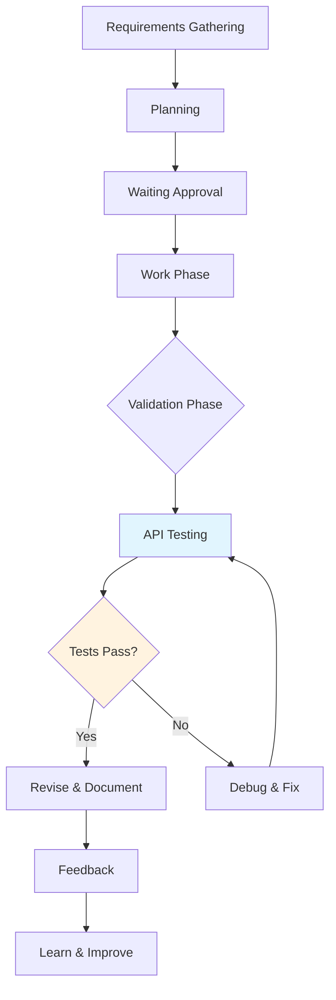

# API Validation Workflow Integration

This rule defines how API validation tools (`get_openapi_spec` and `make_api_request`) should be integrated into the development workflow to enable autonomous testing and continuous validation of implemented features.

## 1. Development Cycle Integration

### 1.1 Workflow Phases with API Validation



### 1.2 Mandatory Integration Points

**During Work Phase:**
- After implementing each endpoint
- After modifying API data structures
- Before marking tasks as complete

**During Validation Phase:**
- Complete validation of implemented feature
- Testing success and error scenarios
- API contract validation

**During Revise Phase:**
- Re-testing after fixes
- Regression validation

## 2. Tool Usage Protocols

### 2.1 `get_openapi_spec` Protocol - MANDATORY FIRST STEP

**🚨 CRITICAL REQUIREMENT: This is the FIRST STEP for ALL testing scenarios**

**When to use:**
- **MANDATORY:** At the beginning of EVERY testing session
- **MANDATORY:** Before ANY API request testing
- **MANDATORY:** To verify if application is online and accessible
- After generating or modifying controllers
- Before implementing client/frontend code
- To understand existing API contracts

**CRITICAL VALIDATION WORKFLOW:**
```javascript
// 1. FIRST: Investigate the default server port and check if it's already running.
//    If the server is not running, only then proceed to start it.
// 2. ONLY THEN proceed with other testing.
// 3. Store insights about the API.
```

**Server Startup Protocol:**
- **If `get_openapi_spec` fails after initial investigation:** Automatically start development server.
- **Wait for server initialization:** Allow 2-3 seconds for server to be ready.
- **Retry validation:** Confirm server is accessible before proceeding.
- **Document server status:** Store server startup patterns for future reference.

**Knowledge storage:**
- Always store significant API changes as `api_mapping` memories
- Document new endpoints and their responsibilities
- Relate endpoints to features and requirements

### 2.2 `make_api_request` Protocol - BACK-END TESTING

**When to use:**
- **EXCLUSIVELY for Back-End endpoint testing.**
- After implementing any endpoint.
- To test success scenarios (happy path).
- To test error scenarios and edge cases.
- To validate changes in existing endpoints.
- During API problem debugging.

**Mandatory test sequence:**

#### 2.2.1 Success Tests (Happy Path)
```javascript
// Basic functionality test
const successTest = await make_api_request({
  method: "POST",
  url: "http://localhost:3000/api/v1/users",
  headers: { "Content-Type": "application/json" },
  body: {
    name: "Test User",
    email: "test@example.com"
  }
});
```

#### 2.2.2 Validation Tests (Boundary Testing)
```javascript
// Test with invalid data
const validationTest = await make_api_request({
  method: "POST",
  url: "http://localhost:3000/api/v1/users",
  headers: { "Content-Type": "application/json" },
  body: {
    name: "", // Required field empty
    email: "invalid-email" // Invalid email
  }
});
```

#### 2.2.3 Authentication/Authorization Tests
```javascript
// Test without authentication (if required)
const authTest = await make_api_request({
  method: "GET",
  url: "http://localhost:3000/api/v1/users/profile"
  // No authentication headers
});
```

#### 2.2.4 Edge Case Tests
```javascript
// Test with very large payload
// Test with special characters
// Test rate limiting boundaries
```

#### 2.2.5 Authenticated Endpoint Testing
**Business Rule**: Before testing authenticated endpoints, you **MUST** request an organization API Key from the developer. You **MUST** also analyze `src/@saas-boilerplate/features/auth/procedures/auth.procedure.ts` and `src/@saas-boilerplate/features/auth/auth.interface.ts` to understand the authentication flow, context, and potential error responses.

```javascript
// Test with a valid API Key
const apiKey = "YOUR_API_KEY_FROM_DEVELOPER"; // This should be provided by the developer

const authenticatedTest = await make_api_request({
  method: "GET",
  url: "http://localhost:3000/api/v1/some-protected-route",
  headers: { 
    "Content-Type": "application/json",
    "Authorization": `Bearer ${apiKey}`
  }
});
```

## 3. Task Management Integration

### 3.1 Per-Task Validation Pattern

**For each implemented task:**
1. **Implement** the functionality.
2. **Validate** using `get_openapi_spec` to verify endpoint appears correctly (for Back-End).
3. **Test** using `make_api_request` with multiple scenarios (for Back-End).
4. **Document** test results.
5. **Store** discovered patterns and insights.
6. **Update** task status only after complete validation.

### 3.2 Task Validation Template

```markdown
# Task Validation: {task_name}

## OpenAPI Validation (Back-End)
- [ ] Endpoint appears in OpenAPI specification
- [ ] Request schema is correct
- [ ] Response schema is correct
- [ ] Status codes are documented

## Functional Testing (Back-End)
- [ ] Happy path test passed
- [ ] Validation error test passed
- [ ] Authentication test passed (if applicable)
- [ ] Edge cases tested
- [ ] Error scenarios tested

## Results Summary
- Success tests: X/X passed
- Error tests: X/X passed
- Performance: Response time < XYZms
- Issues found: [list any issues]

## Next Steps
- [ ] Fix any identified issues
- [ ] Store successful patterns
- [ ] Update documentation if needed
```

## 4. Autonomous Testing Patterns

### 4.1 Test Case Generation

**Based on OpenAPI spec, automatically generate:**
- Test cases for all endpoints (for Back-End).
- Validation of all status codes (for Back-End).
- Tests with valid and invalid data (for Back-End).
- Content type tests (JSON, form-data, etc.) (for Back-End).

### 4.2. Server Status Check

**Business Rule**: Before any testing (Back-End or Front-End), Lia **MUST** verify the server's operational status.

**Server Status Check Protocol:**
1.  **Identify Server URL & Port**: Read `src/igniter.client.ts` to extract the `baseURL` (e.g., `http://localhost:3000`). This is the primary source of truth for the server's address and port.
2.  **Verify Port Execution**: Check if a process is actively listening on the identified port.
3.  **If Port is NOT Running**: Lia **MUST** attempt to start the development server using `start_dev_server({ port: <identified_port>, watch: true })`. After starting, wait for 3 seconds to ensure initialization.
4.  **If Port is Running (for Back-End Testing)**: Proceed to call `get_openapi_spec()` to confirm the API is responsive. If `get_openapi_spec()` fails, this indicates an issue with the API, even if the port is open. In this case, Lia **MUST** report the issue and ask for human intervention.
5.  **If Port is Running (for Front-End Testing)**: Lia can immediately proceed to use browser tools for autonomous front-end validation, as the primary concern is the accessibility of the UI.
6.  **Store Insights**: After successful server status verification and any necessary startup, Lia **MUST** store key insights (e.g., confirmed server port, successful startup pattern) in the memory system as `insight` or `code_pattern`.

## 5. Back-End Testing Protocol (`make_api_request`)

**Purpose**: To rigorously test the API endpoints and server-side logic.

**When to Use:**
- Exclusively for Back-End API endpoint testing.
- After implementing any endpoint.
- To test success scenarios (happy path).
- To test error scenarios and edge cases.
- To validate changes in existing endpoints.
- During API problem debugging.

**Mandatory Test Sequence:**

#### 5.2.1 Success Tests (Happy Path)
```javascript
// Example: Basic functionality test
const successTest = await make_api_request({
  method: "POST",
  url: "http://localhost:3000/api/v1/users",
  headers: { "Content-Type": "application/json" },
  body: {
    name: "Test User",
    email: "test@example.com"
  }
});
```

#### 5.2.2 Validation Tests (Boundary Testing)
```javascript
// Example: Test with invalid data
const validationTest = await make_api_request({
  method: "POST",
  url: "http://localhost:3000/api/v1/users",
  headers: { "Content-Type": "application/json" },
  body: {
    name: "", // Required field empty
    email: "invalid-email" // Invalid email
  }
});
```

#### 5.2.3 Authentication/Authorization Tests
```javascript
// Example: Test without authentication (if required)
const authTest = await make_api_request({
  method: "GET",
  url: "http://localhost:3000/api/v1/users/profile"
  // No authentication headers
});
```

#### 5.2.4 Edge Case Tests
```javascript
// Example: Test with very large payload
// Example: Test with special characters
// Example: Test rate limiting boundaries
```

## 6. Front-End Testing Protocol (Browser Tools)

**Purpose**: To rigorously test the User Interface and client-side interactions using browser tools for autonomous validation.

**When to Use:**
- Exclusively for Front-End autonomous validation.
- After implementing any UI component or page.
- To test user interactions, form submissions, navigation, and UI states.
- To validate changes in existing UI elements.
- During Front-End problem debugging.

**Mandatory Test Sequence:**

#### 6.1 User Journey Testing
```javascript
// Example: Test complete user flows from start to finish using browser tools
await browser_navigate({ url: "/signup" });
await browser_type({
  element: "Email input field",
  ref: "email-input",
  text: "test@example.com"
});
await browser_click({
  element: "Submit button",
  ref: "submit-button"
});
// Verify successful navigation or success message
await browser_wait_for({ text: "Welcome!" });
```

#### 6.2 Form Validation Testing
```javascript
// Example: Test form submissions, validation, and error states using browser tools
await browser_navigate({ url: "/contact" });
await browser_click({
  element: "Submit button",
  ref: "submit-button"
});
// Check for validation error message
await browser_snapshot({ random_string: "validation-error-check" });
```

#### 6.3 Navigation Testing
```javascript
// Example: Test routing, page transitions, and URL changes using browser tools
await browser_navigate({ url: "/" });
await browser_click({
  element: "Dashboard link",
  ref: "dashboard-link"
});
// Verify URL change
await browser_wait_for({ text: "Dashboard" });
```

#### 6.4 Interactive Elements Testing
```javascript
// Example: Test buttons, links, modals, and dynamic content using browser tools
await browser_navigate({ url: "/components" });
await browser_click({
  element: "Open modal button",
  ref: "open-modal-button"
});
// Check modal visibility
await browser_snapshot({ random_string: "modal-visibility-check" });
await browser_click({
  element: "Close modal button",
  ref: "close-modal-button"
});
```

#### 6.5 Responsive Testing
```javascript
// Example: Test across different screen sizes and devices using browser tools
await browser_resize({ width: 375, height: 667 }); // Mobile dimensions
await browser_navigate({ url: "/" });
// Check mobile menu visibility
await browser_snapshot({ random_string: "mobile-menu-check" });
```

#### 6.6 Accessibility Testing
```javascript
// Example: Test keyboard navigation, screen readers, focus management using browser tools
await browser_navigate({ url: "/form" });
await browser_press_key({ key: "Tab" });
// Check focus management
await browser_snapshot({ random_string: "focus-management-check" });
```

## 6. Quality Gates and Exit Criteria

### 6.1 Task Completion Criteria

**A task can only be marked as "done" if:**
- [ ] Endpoint appears correctly in OpenAPI spec (for Back-End).
- [ ] Happy path test returns 2xx status (for Back-End).
- [ ] Error cases return appropriate status codes (for Back-End).
- [ ] Validation tests block invalid data (for Back-End).
- [ ] Performance is within acceptable limits (for Back-End).
- [ ] Test results are documented.

### 6.2 Feature Validation Checklist

**Before considering a feature complete:**
- [ ] All feature endpoints tested (for Back-End).
- [ ] Integration between endpoints validated (for Back-End).
- [ ] End-to-end use case scenarios tested (for Back-End).
- [ ] API documentation updated.
- [ ] Test patterns stored for reuse.

## 7. Error Handling and Recovery

### 7.1 Common Failure Scenarios

**Server not running (Back-End):**
```javascript
// Business Rule: The agent must investigate and identify the default port, then verify if the port is executing.
// ONLY THEN, if the server is not running, it can try to start it.
try {
  const spec = await get_openapi_spec();
} catch (error) {
  // Automatically try to start server
  await start_dev_server({ port: 3000 });
  // Wait for initialization and try again
}
```

**Request timeouts (Back-End):**
```javascript
const result = await make_api_request({
  method: "POST",
  url: "/api/v1/heavy-operation",
  timeout: 30000, // Increase timeout for heavy operations
  body: data
});
```

### 7.2 Debugging Pattern

**When tests fail (Back-End):**
1. **Analyze** `make_api_request` response.
2. **Check** development server logs.
3. **Review** OpenAPI spec for contracts.
4. **Investigate** endpoint code using `analyze_file`.
5. **Store** solution as `bug_pattern` memory.

## 8. Performance and Optimization

### 8.1 Test Execution Strategy

**To avoid overload (Back-End):**
- Execute basic tests after each change.
- Run complete suites periodically.
- Use appropriate timeouts for different test types.
- Cache results for unchanged tests.

### 8.2 Parallel Testing

**With agent delegation (Back-End):**
- Divide tests by features/controllers.
- Execute different test types in parallel.
- Consolidate results at the end.
- Validate no conflicts between parallel tests.

## 9. Memory Storage Patterns

### 9.1 Test Results Storage

```javascript
// Store successful test results (Back-End)
await store_memory({
  type: "api_mapping",
  title: "User API Validation Results",
  content: `# API Validation Results

  ## Endpoints Tested
  - POST /api/v1/users - ✅ 201 Created
  - GET /api/v1/users/:id - ✅ 200 OK
  - PUT /api/v1/users/:id - ✅ 200 OK

  ## Test Cases
  - Valid data creation: PASS
  - Invalid email validation: PASS
  - Authentication required: PASS`,
  tags: ["api", "validation", "user-feature", "testing"],
  confidence: 0.9
});
```

### 9.2 Pattern Recognition

```javascript
// Store identified error patterns (Back-End)
await store_memory({
  type: "bug_pattern",
  title: "Common validation error pattern",
  content: `# Pattern: Zod validation errors return 400

  When request body doesn't match Zod schema:
  - Status: 400 Bad Request
  - Body contains detailed field-level errors
  - Error format: { field: string, message: string }[]`,
  tags: ["validation", "error-handling", "zod", "pattern"]
});
```

## 10. Best Practices Summary

1.  **MANDATORY: Investigate default server port and verify execution first.** If not running, **ONLY THEN start dev server** to allow subsequent tests.
2.  **`get_openapi_spec` is for Back-End server status** and API contract understanding.
3.  **`make_api_request` is EXCLUSIVELY for Back-End endpoint testing.**
4.  **Browser tools are REQUIRED for Front-End autonomous testing AND FREE exploration.**
5.  **Cannot advance tasks without successful browser validation (for Front-End) and successful `make_api_request` validation (for Back-End).**
6.  **Store successful patterns** for reuse.
7.  **Document failure scenarios** for debugging.
8.  **Use appropriate timeouts** for different operations.
9.  **Browser MUST be used FREELY** for research, learning, market analysis, and ANY web-based tasks.
10. **Browser is PRIMARY tool** for continuous learning and staying current with technology trends.
11. **Execute ANY web-based task** requested by the user via browser tools.
12. **Delegate comprehensive testing** to specialized agents.
13. **Validate before marking tasks complete.**
14. **Monitor delegated validation work** regularly.
15. **Build regression test patterns** for critical paths.

This integration of API validation tools and browser tools ensures that Lia can autonomously test her implementations, quickly identify problems, and maintain quality without depending on manual user intervention.
