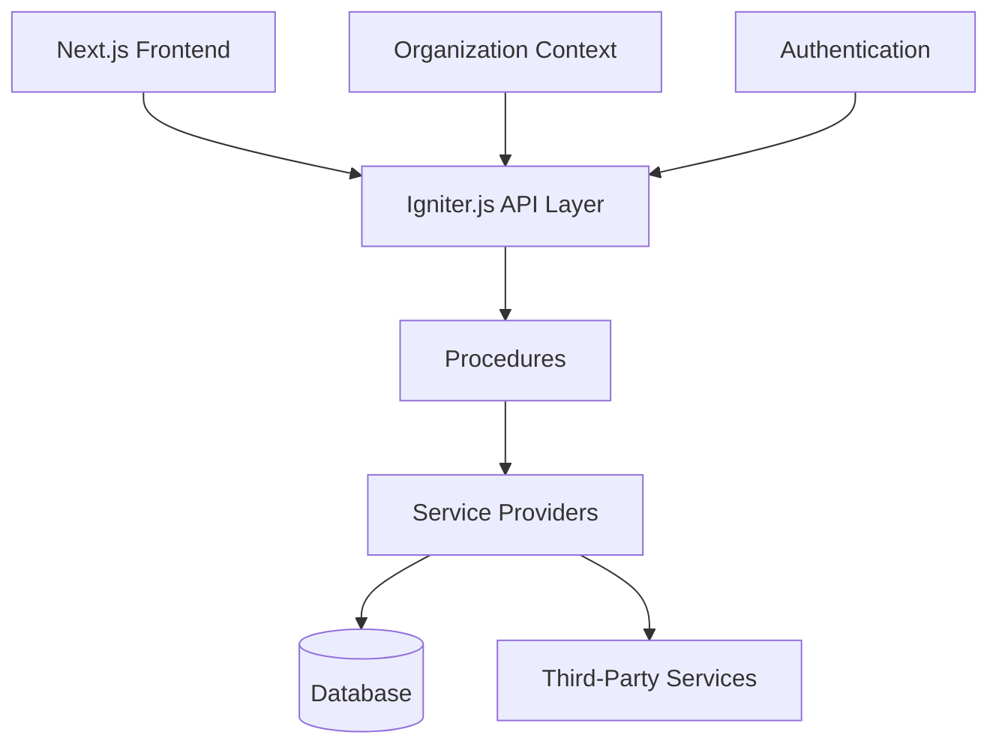

# SaaS Boilerplate

A modern, organization-based, multi-tenant SaaS boilerplate built with Next.js 15, Igniter.js, Prisma, and Shadcn UI.

## 🚀 Features

- ⚡️ **Next.js 15** with App Router
- 🛠 **Igniter.js** for type-safe API development
- 💾 **Prisma** for database management
- 🎨 **Shadcn UI** for beautiful, accessible components
- 🔒 **Authentication** with organization-based multi-tenancy
- 👥 **Role-based access control** (admin, owner, member)
- 💳 **Payments** with Stripe integration (optional - can run without payment features)
- 📧 **Emails** with React Email
- 📂 **File Storage** with AWS S3
- 📱 **Responsive Design** with Tailwind CSS
- 🌗 **Dark Mode** support
- 📝 **Content Management** with Contentlayer
- 🔍 **SEO** optimized
- 📊 **Analytics** ready
- 🧪 **Testing** with Vitest

## 📦 Tech Stack

- **Framework:** [Next.js 15](https://nextjs.org)
- **API Layer:** [Igniter.js](https://igniterjs.com)
- **Database:** [Prisma](https://prisma.io)
- **Authentication:** [Better Auth](https://github.com/better-auth/better-auth)
- **UI Components:** [Shadcn UI](https://ui.shadcn.com)
- **Styling:** [Tailwind CSS](https://tailwindcss.com)
- **Forms:** [React Hook Form](https://react-hook-form.com)
- **Validation:** [Zod](https://zod.dev)
- **Emails:** [React Email](https://react.email)
- **Content:** [Contentlayer](https://contentlayer.dev)
- **Testing:** [Vitest](https://vitest.dev)

## 🏗️ Project Structure

```bash
src/
├── app/                       # Next.js App Router entrypoint
│   ├── (api)/                 # API route handlers (Edge/serverless)
│   ├── (auth)/                # Authentication pages (sign-in, sign-up, etc.)
│   ├── (dashboard)/           # Protected, authenticated app pages
│   ├── (site)/                # Public marketing pages
│   └── (components)/          # Shared layout and shell components
├── configs/                   # Application configuration (env, theme, etc.)
├── content/                   # Static content and documentation
│   └── docs/                  # Markdown docs for Contentlayer
├── components/                # UI components (Shadcn UI, custom)
├── hooks/                     # Custom React hooks
├── providers/                 # App-wide providers (theme, auth, etc.)
├── utils/                     # Utility functions and helpers
├── plugins/                   # Third-party or custom plugins
├── features/                  # Domain features (DDD-style)
│   ├── lead/                  # Example feature module
│   │   ├── controllers/       # API controllers (route logic)
│   │   ├── procedures/        # Business logic/middleware
│   │   ├── presentation/      # Feature UI components
│   │   ├── lead.interface.ts  # TypeScript interfaces/types
│   │   └── lead.router.ts     # Feature API route registration
├──@/@saas-boilerplate/         # Core SaaS modules (importable)
│   ├── features/              # Core features (auth, billing, org, etc.)
│   ├── hooks/                 # Core hooks
│   ├── providers/             # Service providers (db, email, etc.)
│   └── utils/                 # Core utilities
├── igniter.client.ts          # Igniter.js client API config
├── igniter.context.ts         # Igniter.js context (DI, providers)
├── igniter.router.ts          # Igniter.js API router
└── igniter.ts                 # Igniter.js main entrypoint
```

## 🚦 Getting Started

### Prerequisites

- Node.js 22+
- Bun, npm, yarn or pnpm
- Github CLI with HTTPS Auth
- Docker (for local development)
- AWS Account (for S3) - optional
- Stripe Account (for payments) - optional

> **Note:** Payment provider (Stripe) is now optional! You can run the entire application without configuring Stripe. Simply leave the Stripe environment variables empty to disable payment features. See [Payment Provider Documentation](./.github/docs/payment-provider-optional.md) for more details.

### Installation Options

#### Option 1: Using the CLI (Recommended)

The easiest way to get started is using our CLI, which will guide you through the setup process:

```bash
npx saas-boilerplate create my-saas-app
```

Replace `my-saas-app` with your project name. The CLI will:

1. Create a new directory with your project name
2. Set up the boilerplate with all dependencies
3. Configure initial environment variables
4. Guide you through the remaining setup steps

Simply follow the CLI prompts to complete the installation.

#### Option 2: Cloning the Repository

1. Clone the repository:

```bash
git clone https://github.com/felipebarcelospro/saas-boilerplate
cd saas-boilerplate
```

2. Install dependencies:

```bash
bun install

npm install --legacy-peer-deps

yarn install
```

3. Copy the environment variables:

```bash
cp .env.example .env
```

4. Start the development database:

```bash
bun docker:up

// or
npm run dev

// or
yarn dev
```

5. Run database migrations:

```bash
bun db:migrate:dev

// or
npm run db:migrate:dev

// or
yarn db:migrate:dev
```

6. Start the development server:

```bash
bun dev

// or
npm run dev

// or
yarn dev
```

Your SaaS Boilerplate application should now be running at [https://localhost:3000](https://localhost:3000).

## 🏛 Architectural Overview



### Key Design Decisions

| Decision Area    | Implementation Details          | Rationale                                                         |
| ---------------- | ------------------------------- | ----------------------------------------------------------------- |
| Multi-tenancy    | Organization-based Architecture | Proper data isolation and role-based access within organizations  |
| State Management | Igniter.js + Context API        | Type-safe data fetching with server state management              |
| API Security     | Role-based Access Control       | Fine-grained permissions based on user roles within organizations |
| Error Handling   | Unified Error Responses         | Consistent error handling across the application                  |
| Payments Engine  | Stripe Integration              | Industry-standard payment processing with subscription management |

## 🛠 Customization Guide

### Adding a E-mail Adapter Provider

1. **Implement the adapter interface:**

```typescript
// src/@saas-boilerplate/providers/mail/adapters
export const customEmailAdapter = MailProvider.adapter(
  (options: MailProviderOptions) => ({
    send: async ({ to, subject, html, text, scheduledAt }) => {
      // Add your custom implementation here
    },
  }),
)

```

2. **Register the provider:**

```typescript
// src/@saas-boilerplate/providers/mail/utils
export const getAdapter = (adapter: string) => {
  switch (adapter) {
    case 'resend':
      return resendAdapter
    case 'smtp':
      return smtpAdapter
    case 'custom':
      return customAdapter
    default:
      throw new Error(`Adapter ${adapter} not found`)
  }
}
```

## 🤝 Contributing

We welcome contributions! Before you begin:

- Review the [Code of Conduct](CODE_OF_CONDUCT.md) and [Security Policy](SECURITY.md).
- Follow the steps in [CONTRIBUTING.md](CONTRIBUTING.md) and the [Contribution Checklist](.github/docs/contribution-checklist.md).
- Use the provided issue templates when filing bugs or feature requests.
- Licensed customers can reach the core team at `felipe@igniterjs.com` for premium support or implementation guidance.

When you open a pull request, please complete the PR template and include test results. If you are unsure where to start, open an issue and we will help scope the work.

## 📄 License

This project is licensed under a Source Available License. See the [LICENSE](./LICENSE) file for details.

### License Summary

- **Commercial Use**: Allowed for unlimited applications
- **Modification**: Allowed for your own use
- **Distribution**: You may distribute applications built with this software
- **Reselling**: Not permitted as a template or part of another product
- **Updates**: One year of updates and support included with purchase
- **Perpetual Use**: Continue using and developing applications even after access period ends

For licensing inquiries, please contact the copyright holder.
